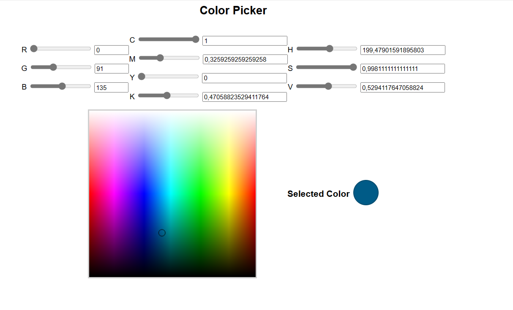

# Компьютерная графика - Лабораторная 1

## Варвашевич А.Г., 3 Группа

[Сайт с лабой](https://angelina-varvashevich.github.io/computer-graphics/lab-1/color_picker.html)

### Выполняемые Задачи и Цели

Веб-приложение, позволяющее пользователю выбирать, а
затем интерактивно менять цвет, показывая при этом его составляющие в одной из
3 цветовых моделей: RGB, CMYK, HSV.

Алгоритмы перевода цветов, между различными моделями написаны вручную на основе
материалов из различных источников.

Простой, интуитивный и дружелюбный пользовательский интерфейс:

### Функциональные Возможности

- 3 Способа задания цвета:
    - Плавная регулировка (Ползунки)
    - Ввод значений с клавиатуры
    - Точечный выбор с помощью цветовой палитры

- Автоматический пересчет показателей при смене цветовой модели
- Невозможность ввода неправильной информации
- Дружелюбный интерфейс

### Технические параметры

Инструменты разработки:

- JavaScript, HTML
- WebStorm

Платформа: браузерная

### Итог

По итогам работы было создано приложение для браузерной платформы, реализующее функционал интерактивного выбора цвета и алгоритмы его преобразований
в различных цветовых пространствах. Элементы пользовательского интерфейса приложения, включая слайдеры, поля для ввода и цветовую палитру, дают возможность взаимодействия с программой различными способами, удобными для пользователя. Я изучила связь и алгоритмы перевода между цветовыми моделями
RGB, CMYK, HSV -- наиболее широко применямыми моделями цветовых пространств.

### Список Ресурсов и Источников

1. Лекционный материал (лекция №1)